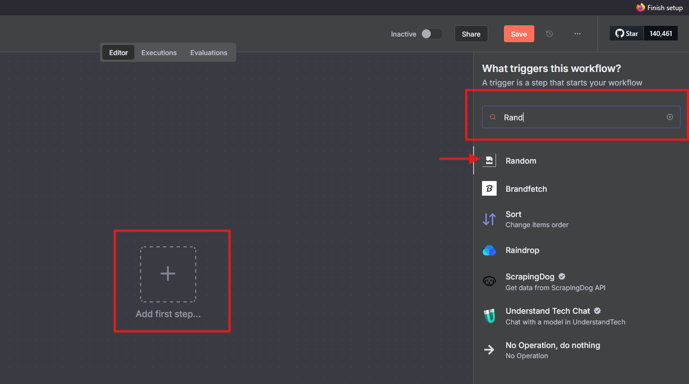
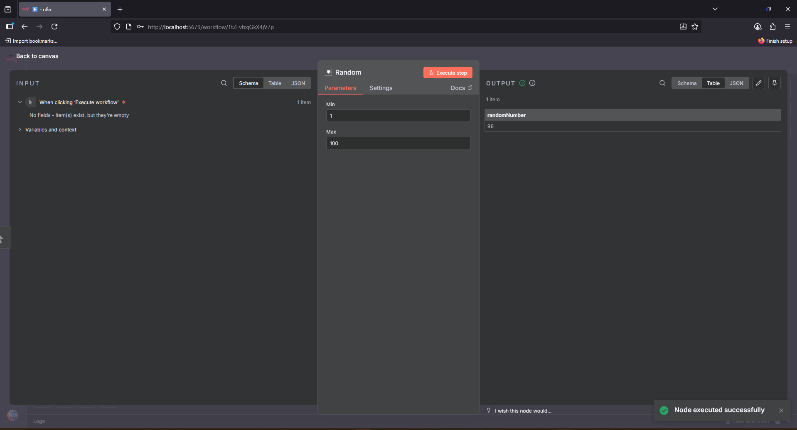

# Desafio Onlfy

Este repositório disponibiliza um nó personalizado para o n8n, criado como parte de um desafio de integração da Onlfy.

O nó chamado `Random` utiliza a API pública do [Random.org](https://www.random.org/) para gerar números aleatórios reais, dentro de um intervalo definido pelo usuário.

## O que o nó faz

Gera números alteatórios com base em um input de número mínimo (`Min`) e máximo (`Max`).

## Requisitos

Para rodar o projeto corretamente, certifique-se de ter instalado:

* [Node.js](https://nodejs.org/en/) (versão LTS, por exemplo 22.x)
* [npm](https://www.npmjs.com/) (geralmente acompanha o Node.js)
* [Rancher Desktop](https://rancherdesktop.io/) ou [Docker](https://www.docker.com/products/docker-desktop/) + [Docker Compose](https://docs.docker.com/compose/install/)

## Passo a Passo para Executar

### 1. Instalação das Dependências

Entre na pasta do nó e instale os pacotes necessários para compilar o TypeScript:

```bash
cd n8n-nodes-random
npm install
```

Depois, compile o código:

```bash
npm run build
```

Isso criará a pasta `dist` com os arquivos JavaScript prontos para uso no n8n.

### 2. Subir o Ambiente n8n com Docker

O `docker-compose.yml` incluído já vem configurado para iniciar uma instância do n8n junto com um banco PostgreSQL, além de montar a pasta do nó customizado.

Para iniciar, execute:

```bash
docker-compose up -d
```

O n8n ficará acessível em [http://localhost:5678](http://localhost:5678) após alguns segundos.

### 3. Testando o Nó no n8n

1. Abra a interface do n8n em [http://localhost:5678](http://localhost:5678)
2. Crie um novo workflow
3. Clique em `+` para adicionar um nó
4. Procure por "Random"
5. O nó customizado aparecerá com o seu ícone. Adicione-o ao workflow
6. Preencha os valores de "Min" e "Max" e execute para conferir o resultado

Passo a passo para executar:



Resultado da execução:

